<p align="center">
  <a href="https://omnipiano.site/">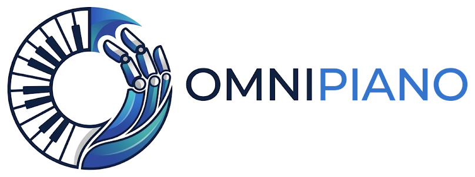</a>
</p>

<p align="center">
  <b>Diverse Dexterous Piano-Playing Challenges for Standard, Robust, Safe, and Multi-Agent RL</b>
</p>

<p align="center">
  <a href="https://omnipiano.site/"></a>
  <a href="https://omnipiano-docs.readthedocs.io/en/latest/"></a>
  
  
  
  <a href="https://github.com/SAIL-Research-Lab/omnipiano/issues"></a>
</p>

<p align="center">
  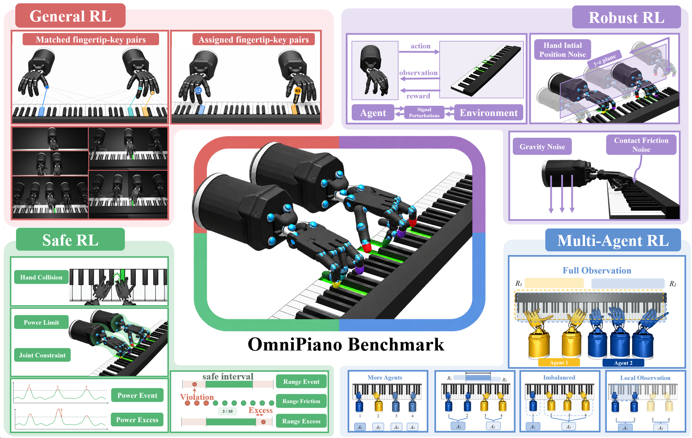
</p>

OmniPiano is a benchmark for dexterous, multi-hand piano playing built on
[RoboPianist](https://github.com/google-research/robopianist) and
[MuJoCo](https://github.com/google-deepmind/mujoco). RoboPianist uses two
Shadow Hands; OmniPiano supports **one to five hands, with up to 111
continuous action dimensions**. It offers four benchmark tracks that share the
same piano, the same MIDI objective and the same evaluation metrics:

| Track | What changes | Interface | Task settings\* | Baselines\* |
|---|---|---|---:|---:|
| 🎼 **Standard RL** | Repertoire and hand morphology: 1–5 hands, either *unrestricted* (fully mobile) or *restricted* (each hand clamped to its own register); annotation or optimal-transport (OT) fingering | Gymnasium | 72 | 10 |
| 🌪️ **Robust RL** | Noise on the action, observation, reward, gravity, fingertip–key friction or initial hand pose, drawn from a Gaussian, uniform or constant-shift distribution; channels can be combined | Gymnasium | 216 | 4 |
| 🛡️ **Safe RL** | Musical reward and physical safety cost are separate signals: joint range, actuator power, injured finger, hand collision × Event / Fraction / Excess cost | Gymnasium (CMDP) | 480 | 14 |
| 🤝 **Multi-Agent RL** | Hands are split across decentralized agents that share one team reward. Four cooperation axes (**SCHO**): **S**calability, **C**oupling, **H**eterogeneity, **O**bservability | PettingZoo `ParallelEnv` | 144 | 8 |

<sub>\* Counts from the paper, which evaluates 912 task settings with 36 RL baselines plus 4 LLM-based agents in total.</sub>

Each track changes **one factor** of the shared piano task. A difference in
performance can therefore be attributed to that single design choice.

---

## 📑 Contents

- [Demos](#-demos)
- [Installation](#-installation)
- [Quick start](#-quick-start)
- [Tasks](#-tasks)
- [Training baselines](#-training-baselines)
- [Evaluation protocol and metrics](#-evaluation-protocol-and-metrics)
- [Repository layout](#-repository-layout)
- [Contributing](#-contributing)
- [Acknowledgements](#-acknowledgements)

---

## 🎬 Demos

Click any clip to open the full-length video. More rollouts are on the [project website](https://omnipiano.site/#videos).

<table>
  <tr>
    <td align="center" width="33%">
      <a href="https://omnipiano.site/assets/videos/std-sac-furelise-1hand.mp4">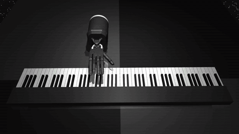</a><br>
      <sub><b>One hand, unrestricted</b><br><i>Für Elise</i></sub>
    </td>
    <td align="center" width="33%">
      <a href="https://omnipiano.site/assets/videos/std-sac-furelise-2hand.mp4">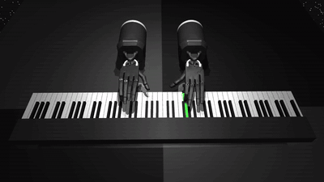</a><br>
      <sub><b>Two hands, unrestricted</b><br><i>Für Elise</i></sub>
    </td>
    <td align="center" width="33%">
      <a href="https://omnipiano.site/assets/videos/std-sac-greatkiev-3hand.mp4">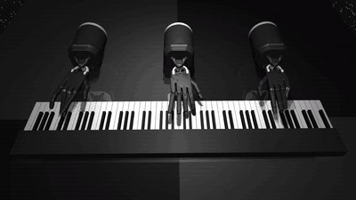</a><br>
      <sub><b>Three hands, restricted</b><br><i>Pictures at an Exhibition</i> (Great Kiev)</sub>
    </td>
  </tr>
  <tr>
    <td align="center" width="33%">
      <a href="https://omnipiano.site/assets/videos/std-sac-winterwind-4hand.mp4">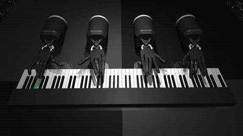</a><br>
      <sub><b>Four hands, restricted</b><br><i>Winter Wind</i></sub>
    </td>
    <td align="center" width="33%">
      <a href="https://omnipiano.site/assets/five-hand-demo.gif">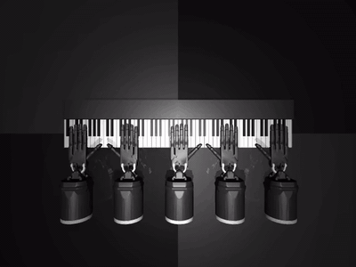</a><br>
      <sub><b>Five hands, restricted</b><br>Each hand confined to its own keyboard region</sub>
    </td>
    <td align="center" width="33%">
      <a href="https://omnipiano.site/assets/collision-demo.gif"></a><br>
      <sub><b>Safe RL: hand collision</b><br>Limiting contact between neighboring hands</sub>
    </td>
  </tr>
  <tr>
    <td align="center" width="33%">
      <a href="https://omnipiano.site/assets/videos/rob-clairdelune-2hand-action.mp4">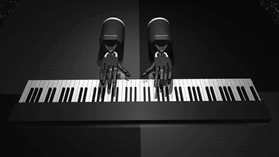</a><br>
      <sub><b>Two hands, action noise</b><br><i>Clair de Lune</i></sub>
    </td>
    <td align="center" width="33%">
      <a href="https://omnipiano.site/assets/videos/rob-furelise-3hand-obs-action.mp4">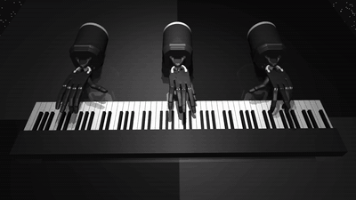</a><br>
      <sub><b>Three hands, observation + action noise</b><br><i>Für Elise</i></sub>
    </td>
    <td align="center" width="33%">
      <a href="https://omnipiano.site/assets/videos/rob-furelise-5hand-obs.mp4">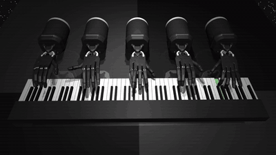</a><br>
      <sub><b>Five hands, observation noise</b><br><i>Für Elise</i></sub>
    </td>
  </tr>
  <tr>
    <td align="center" width="33%">
      <a href="https://omnipiano.site/assets/videos/marl-two-agents-four-hands.mp4">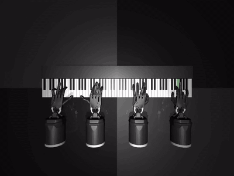</a><br>
      <sub><b>Two agents, four hands</b><br><i>Winter Wind</i> · Base setting</sub>
    </td>
    <td align="center" width="33%">
      <a href="https://omnipiano.site/assets/videos/marl-heterogeneity.mp4">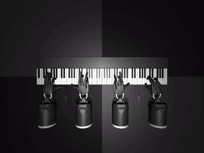</a><br>
      <sub><b>One hand vs. three hands</b><br><i>Winter Wind</i> · Heterogeneity setting</sub>
    </td>
    <td align="center" width="33%">
      <a href="https://omnipiano.site/assets/videos/marl-four-agents-one-hand.mp4">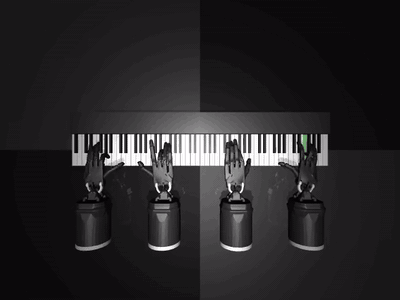</a><br>
      <sub><b>Four agents, one hand each</b><br><i>Winter Wind</i> · Scalability setting</sub>
    </td>
  </tr>
</table>

---

## 🛠️ Installation

OmniPiano runs on **Linux** with **Python ≥ 3.10**. Windows users can use WSL2.
Unlike the original RoboPianist, the Shadow Hand models and the default
soundfont (`TimGM6mb.sf2`) are bundled with the repository, so you do **not**
need `git submodule` or `install_deps.sh`.

**1. System packages**

```bash
sudo apt-get update
sudo apt-get install -y build-essential fluidsynth libfluidsynth-dev portaudio19-dev ffmpeg libegl1 libgl1
```

**2. Python environment and package**

```bash
conda create -n pianist python=3.10 -y
conda activate pianist

git clone https://github.com/SAIL-Research-Lab/omnipiano.git
cd omnipiano
pip install -e .                 # core: Gymnasium + PettingZoo envs, SB3 baselines
```

Optional extras for particular tracks:

| Extra | Installs | Used by |
|---|---|---|
| `pip install -e '.[torchrl]'` | `torch 2.10`, `torchrl 0.13`, `tensordict 0.13` | Robust-RL baselines (PPO, SAC, EPPO, A2P-SAC, SCPO, OMPO) |
| `pip install -e '.[marl]'` | `ray[rllib]==2.55.1`, `wandb` | Multi-agent baselines (IPPO, MAPPO, HAPPO, A2PO, FACMAC, centralized PPO) |
| separate env, see [Safe RL](#safe-rl-omnisafe) | `omnisafe==0.5.0`, `safety-gymnasium==0.4.1` | Safe-RL baselines (32 OmniSafe algorithms) |

> [!IMPORTANT]
> Put the **Safe-RL** stack (OmniSafe) in its **own conda environment**. It pins
> older Gymnasium, NumPy and SciPy versions. Follow
> [`omnipiano/safety/QUICKSTART.md`](omnipiano/safety/QUICKSTART.md).

**3. Piano Fingering Dataset (PIG)**

Benchmark pieces come from the
[PIG dataset](https://beam.kisarazu.ac.jp/~saito/research/PianoFingeringDataset/).
Its license does not allow redistribution, so you must download it yourself.
Download `PianoFingeringDataset_v1.2.zip` (free registration), unzip it, then run:

```bash
robopianist preprocess --dataset-dir /PATH/TO/PianoFingeringDataset_v1.2
robopianist --check-pig-exists        # -> "PIG dataset is ready to use!"
```

**4. Verify**

```bash
export MUJOCO_GL=egl   # headless rendering; use "glfw" on a desktop with a display
python -c "import omnipiano; env = omnipiano.make('OmniPiano-TwinkleTwinkleLittleStar-TwoHand-GeneralRL-v0'); print(env.action_space)"
```

*Optional:* for better-sounding rendered videos, run
`robopianist soundfont --download`.

> [!TIP]
> Set `MUJOCO_GL` **before** Python starts. Importing `omnipiano` builds the
> MuJoCo-backed task registry.

---

## 🚀 Quick start

### Single-agent (Standard / Robust / Safe tracks): Gymnasium

```python
import omnipiano

# mode="eval" adds musical metrics (F1, precision, recall) to the final-step info;
# the default mode="train" reports only the reward-term decomposition.
env = omnipiano.make("OmniPiano-WinterWind-FourHand-StaticPartition-GeneralRL-v0", seed=0, mode="eval")
obs, info = env.reset(seed=0)

terminated = truncated = False
while not (terminated or truncated):
    action = env.action_space.sample()            # replace with your policy
    obs, reward, terminated, truncated, info = env.step(action)

print("key-press F1 :", info["episode_task/f1"])
print("precision    :", info["episode_task/key_precision"])
print("recall       :", info["episode_task/key_recall"])
env.close()
```

A random policy is only an interface demo. Meaningful playing requires
training (see [Training baselines](#-training-baselines)).

### Safe RL: reward and cost are separate

```python
import omnipiano
from omnipiano.safety.suite import MAIN, register_task   # or register_all()

env_id = register_task(MAIN[0])   # 2-hand Für Elise, joint-range / Fraction cost
env = omnipiano.make(env_id, seed=1)
obs, info = env.reset(seed=1)
obs, reward, terminated, truncated, info = env.step(env.action_space.sample())

print(reward)                                   # musical reward (cost is NOT subtracted)
print(info["step_safety/cost_total"])           # per-step safety cost c_t
# at episode end: info["episode_safety/cost_total"]  -> compare with the budget d
```

### Multi-agent: PettingZoo `ParallelEnv`

```python
import omnipiano
from omnipiano.multiagent import make_parallel, list_parallel_envs

print(list_parallel_envs())
env = make_parallel("OmniPiano-WinterWind-FourHand-MA-Duet-Territorial-v0", seed=0)
obs, infos = env.reset(seed=0)
print(env.agents)                                # ['secondo', 'primo']

while env.agents:
    actions = {a: env.action_space(a).sample() for a in env.agents}
    obs, rewards, terminations, truncations, infos = env.step(actions)
```

### Listing tasks

```python
import omnipiano
from omnipiano.envs.registration import _registry
from omnipiano.safety.suite import register_all

register_all()                       # the factorized safety suite registers on demand
print(len(_registry), *sorted(_registry), sep="\n")
```

`omnipiano.make(env_id, **kwargs)` accepts **registered IDs only**. Every
setting that defines an experiment (reward, safety, robustness, hands) is
fixed by the ID. Only runtime options are accepted as kwargs: `seed`,
`record_dir`, `record_every`, `record_resolution`, `camera_id`,
`mode` (`"train"` or `"eval"`) and, for robustness evaluation,
`eval_noise_scale`. To change anything
else, register a new ID (see [Contributing](#-contributing)).

---

## 🗂️ Tasks

### 🎼 Standard RL: morphology × repertoire

```
OmniPiano-{Song}-{OneHand|TwoHand}-GeneralRL-v0
OmniPiano-{Song}-{Three|Four|Five}HandPrototype-GeneralRL-v0          # unrestricted: fully mobile hands
OmniPiano-{Song}-{Three|Four|Five}Hand-StaticPartition-GeneralRL-v0   # restricted: each hand clamped to a register
```

| | 1 hand | 2 hands | 3 / 4 / 5 hands, unrestricted | 3 / 4 / 5 hands, restricted |
|---|:-:|:-:|:-:|:-:|
| `TwinkleTwinkleLittleStar` (easy, 161 steps) | ✓ | ✓ | ✓ | ✓ |
| `PicturesGreatKiev` (medium, 720 steps) | ✓ | ✓ | ✓ | ✓ |
| `WinterWind` (hard, 314 steps, 16.6 notes/s) | ✓ | ✓ | ✓ | ✓ |

* `GeneralRL` tasks use the **OT fingering reward**. It solves a
  fingertip-to-key assignment with the Hungarian algorithm, so it works for any
  MIDI file and any number of hands. To compare with annotated fingering, use
  `OmniPiano-ForElise-FingeringAnn-v0` vs `OmniPiano-ForElise-FingeringOT-v0`.
* Additional morphology tasks (`PolonaiseOp40No1`, `PianoSonataNo281StMov`,
  `PianoSonataNo301StMov`, …) are registered without the `-GeneralRL` suffix,
  e.g. `OmniPiano-PicturesGreatKiev-ThreeHand-StaticPartition-v0`.
* The reward follows RoboPianist:
  $r_t = r^{key}_t + r^{match}_t - \lambda_{energy} r^{energy}_t$.

### 🌪️ Robust RL: perturbation channels

Signal perturbations (action **A**, observation **O**, reward **R**) are applied
at every step. Environment perturbations (gravity **G**, contact friction
**CF**, hand pose **HP**) are sampled per episode or per step.

```
OmniPiano-ClairDeLune-Clean-v0                                   # unperturbed reference
OmniPiano-ClairDeLune-{A|O|R}-{Gauss|Uniform|Shift}-P{level}-v0  # e.g. A-Gauss-P05, O-Uniform-P20, R-Shift-P50
OmniPiano-ClairDeLune-G-{Gauss|Uniform|Shift}-P{200|300|400}-v0  # G-Step-... = per-step variants
OmniPiano-ClairDeLune-CF-{Gauss|Uniform|Shift}-P{20|30|40}-v0
OmniPiano-ClairDeLune-HP-{Gauss|Uniform|Shift}-Y{10|25|50}-Z{05|10|20}-v0
```

| Channel | Perturbed quantity | Levels in ID (low / med / high) |
|---|---|---|
| `A` Action | canonical actuator target | `P05 / P10 / P15` |
| `O` Observation | proprioception + piano state (goals untouched) | `P10 / P20 / P30` |
| `R` Reward | scalar reward seen by the learner | `P10 / P30 / P50` |
| `G` Gravity | vertical acceleration $g_z$ | `P200 / P300 / P400` |
| `CF` Friction | fingertip–key sliding coefficient | `P20 / P30 / P40` |
| `HP` Hand pose | per-hand initial (y, z) offset, mm | `Y10-Z05 / Y25-Z10 / Y50-Z20` |

**Composed perturbations**, e.g. `OmniPiano-ClairDeLune-AO-Gauss-P15-v0`,
`OmniPiano-ClairDeLune-GCFHP-Gauss-G150-CF15-Y50-Z20-v0`, and a three-hand
Für Elise ladder O → OR → ORA → ORAG → ORAGHP
(`OmniPiano-ForElise-ThreeHand-ORAGHP-Gauss-O20-R30-A10-G300-Y25-Z10-v0`).

### 🛡️ Safe RL: CMDP tasks

```
OmniPiano-Safety-{Song}-{N}H-{semantic}-{setting}-{hash}-v1      # registered via omnipiano.safety.suite
```

| Safety semantic | Monitored signal |
|---|---|
| `joint_range` | J2 joints of all five fingers outside the central 50% of their native range |
| `actuator_power` | instantaneous mechanical power $\lvert\tau \cdot \dot q\rvert$ above a reference |
| `injured_finger` | power of a designated ("injured") thumb above a lower limit |
| `hand_collision` | normal contact force between any pair of hands |

| Cost setting | Per-step cost | Measures |
|---|---|---|
| `event` | $\mathbb{1}[\text{any violation}]$ | occurrence |
| `fraction` | share of monitored elements in violation | extent |
| `excess` | mean normalized excess beyond the limit | severity |

Episode budgets default to $d = 0.05\,T$ for event/fraction and $d = 0.02\,T$
for excess, where $T$ is the episode length. Task groups: `main` (8 tasks,
2–5 hands), `hands` (hand-count sensitivity), `budget` (5 budgets from 1.44 to
144) and `extensions` (48 tasks). See
[`omnipiano/safety/README.md`](omnipiano/safety/README.md).
A policy that keeps its cost low by *not playing* counts as a trivially-safe
failure. Judge feasibility first, then musical quality.

### 🤝 Multi-agent RL: SCHO

| Registered `ParallelEnv` IDs | Agents |
|---|---|
| `OmniPiano-{WinterWind, PicturesGreatKiev, PianoSonataNo301StMov}-FourHand-MA-Duet-Territorial-v0` | 2 (`secondo`, `primo`) |
| `OmniPiano-{WinterWind, PicturesGreatKiev, PolonaiseOp40No1, PianoSonataNo281StMov}-ThreeHand-MA-MainSolo-Territorial-v0` | 2 |
| `OmniPiano-WinterWind-FiveHand-MA-Trio-Territorial-v0` | 3 |

The paper's SCHO suite runs on four-hand *Winter Wind* (keys 1–88):

| Setting | Agents : hands | Action ranges | Changes relative to Base |
|---|---|---|---|
| Base | 2 : (2, 2) | 1–44 / 45–88 | none |
| Observability | 2 : (2, 2) | same as Base | observation ranges widened from 49 to 70 keys |
| Coupling | 2 : (2, 2) | 1–70 / 19–88 | 52-key shared action range |
| Heterogeneity | 2 : (1, 3) | 1–22 / 23–88 | control load 22 vs 66 actions |
| Scalability | 4 : (1, 1, 1, 1) | 22 keys each | four agents instead of two |

Custom layouts (hands per agent, action and observation ranges, overlaps) are
JSON task files. Start from
[`omnipiano/multiagent/configs/marl_task_example.json`](omnipiano/multiagent/configs/marl_task_example.json)
and load it with `omnipiano.multiagent.make_parallel_from_task(cfg["task"])`.

---

## 🏋️ Training baselines

OmniPiano is **framework-agnostic**: any Gymnasium or PettingZoo trainer can
consume the environments. For reproducibility we ship the reference trainers
used in the paper.

### Standard RL: Stable-Baselines3 / sb3-contrib

```bash
# PPO | SAC | TD3 | TQC | CrossQ at library-default hyperparameters
python examples/run_sb3_baseline.py --algo sac --env OmniPiano-WinterWind-TwoHand-GeneralRL-v0 --seed 0
python examples/run_sb3_baseline.py --algo ppo --env OmniPiano-PicturesGreatKiev-ThreeHand-StaticPartition-GeneralRL-v0 --seed 0 --smoke-test

# Render a trained checkpoint to MP4 (with audio)
python examples/render_checkpoint.py --ckpt examples/logs/<run>/best_model.zip --env <ENV_ID>
```

### Robust RL: TorchRL (`pip install -e '.[torchrl]'`)

```bash
# --algo: ppo | sac | eppo | a2p_sac | scpo | ompo
python examples/run_torchrl_robust.py --algo sac --env OmniPiano-ClairDeLune-A-Gauss-P05-v0 --device cuda --seed 0

# Evaluate one checkpoint across noise scales (0 = clean)
python examples/robust_eval_sweep.py --framework torchrl --algo sac --ckpt <CKPT_DIR> \
    --env OmniPiano-ClairDeLune-A-Gauss-P05-v0 --scales 0 0.5 1 2 4
```

<a id="safe-rl-omnisafe"></a>
### Safe RL: OmniSafe (separate env)

```bash
conda create -n omnipiano-safety python=3.10 -y && conda activate omnipiano-safety
pip install -e . -r omnipiano/safety/requirements.txt
pip install --no-deps omnisafe==0.5.0 safety-gymnasium==0.4.1
export MUJOCO_GL=egl OMP_NUM_THREADS=1

python -m omnipiano.safety.smoke --steps 2 --out safety_smoke.json      # installation check
python -m omnipiano.safety.run --list-algorithms                        # 32 OmniSafe algorithms
python -m omnipiano.safety.run --group main --task-index 0 \
    --algorithms PPO PPOLag CPO CUP OnCRPO --seeds 1 2 3 \
    --device cuda:0 --out results_safety --execute                      # drop --execute to print the plan only
python -m omnipiano.safety.compare --group main --runs results_safety --out figures_safety
```

The cost limit is the task's episode budget and is passed to each algorithm
automatically. To sweep it, use `--group budget`. Details, including an
expected `pip check` warning about Safety-Gymnasium's `mujoco==2.3.0` pin, are in
[`omnipiano/safety/QUICKSTART.md`](omnipiano/safety/QUICKSTART.md) and
[`ALGORITHMS.md`](omnipiano/safety/ALGORITHMS.md).

### Multi-agent RL: RLlib + native implementations (`pip install -e '.[marl]'`)

```bash
python -m omnipiano.multiagent.train --list-algos      # ippo, mappo, happo, a2po, facmac, ppo-monolithic, ...
python -m omnipiano.multiagent.train --list-envs

# One run per seed; --algo selects the baseline
python -m omnipiano.multiagent.train --algo ippo \
    --env-id OmniPiano-WinterWind-FourHand-MA-Duet-Territorial-v0 --seed 0 --wandb-mode disabled
python -m omnipiano.multiagent.train --algo ippo --smoke-test --num-gpus-per-learner 0 --wandb-mode disabled

# Custom task / run config (JSON) as the first positional argument
python -m omnipiano.multiagent.train omnipiano/multiagent/configs/marl_task_example.json --algo facmac

# Generate the five SCHO task + run configs (seeds 0-2)
python scripts/gen_scho_runs.py --out ./scho_suite --suite-id scho_v2 --phase train \
    --algos ippo mappo happo a2po facmac --run-root ./omnipiano_runs
```

`ppo-monolithic` is the centralized reference: a single PPO policy drives all
hands. It answers the question "is MARL necessary?". Each run writes
`run_config.json`, `progress.jsonl`, `periodic_eval.jsonl` (F1, team return and
coordination metrics), periodic checkpoints and `eval_summary.json`.

### LLM-based agents

The LLM agent writes a full Python controller that outputs an open-loop
actuator trajectory. The controller runs in simulation, and F1, reward,
timing errors and trajectory diagnostics are fed back to the LLM for the next
attempt.

```bash
export CLAUDE_API_KEY=...        # key for the configured OpenAI-compatible endpoint
python examples/run_keyframes.py --env OmniPiano-ClairDeLune-Clean-v0 --tries 10
python examples/run_eval.py      --env OmniPiano-ClairDeLune-Clean-v0 --record
```

Set the model, endpoint and API-key variable at the top of
[`examples/run_keyframes.py`](examples/run_keyframes.py). It calls any
OpenAI-compatible API through the `openai` client.

---

## 📏 Evaluation protocol and metrics

Only a few settings are shared across frameworks. They live in
`BenchmarkProtocolConfig` (`omnipiano/configs/__init__.py`). Everything else,
such as batch size, network architecture and learning rate, stays at each
library's own defaults.

| Protocol field | Value |
|---|---|
| `total_env_steps` | 5,000,000 |
| `seeds` | (0, 1, 2) |
| `gamma` | 0.8 (task property: short effective horizon) |
| `eval_freq_env_steps` | 50,000 |
| `num_eval_eps` | 1 (deterministic policy) |

**Metrics exposed in `info`:**

| Key | Meaning |
|---|---|
| `episode_task/f1`, `episode_task/key_precision`, `episode_task/key_recall` | Key-press F1 (primary musical metric), as in RoboPianist. `mode="eval"` only |
| `episode_task/sustain_f1` | Sustain-pedal F1. `mode="eval"` only |
| `episode_task/{key_press,fingering,ot_fingering,energy,forearm}_reward` | Per-term reward decomposition |
| `step_safety/cost_total`, `episode_safety/cost_total` | Per-step / undiscounted episodic safety cost (compare with the budget $d$) |
| `step_safety/violation_any`, `episode_safety/violations` | Violation indicators and counts |

Multi-agent runs also report `common_area_success_rate`,
`common_area_duplicate_press_rate` and `inter_agent_collision_step_rate`.

---

## 📁 Repository layout

```text
omnipiano/
├── envs/              # task registry (`register`/`make`), dm_env → Gymnasium adapter, vendored robopianist
├── tasks/             # MJCF-level task variants, N-hand `HandSpec`, static partitions
├── wrappers/          # MetricsWrapper → SafetyWrapper → RobustWrapper
├── safety/            # constraint library, factorized safety suite, OmniSafe runner + CMDP bridge
├── multiagent/        # PettingZoo ParallelEnv, SCHO task compiler, IPPO/MAPPO/HAPPO/A2PO/FACMAC trainers
├── integrations/      # framework glue: sb3, torch_rl (robust algos), llm agents
├── configs/           # BenchmarkProtocolConfig, env / safety / robust dataclasses
└── tests/             # pytest suite
examples/              # reference trainers, evaluation, rendering, plotting
scripts/               # MARL launchers and SCHO generators
docs/                  # Sphinx sources for the tutorial site
```

---

## 🤝 Contributing

We welcome bug reports, new tasks and new baselines. Open an
[issue](https://github.com/SAIL-Research-Lab/omnipiano/issues) or a pull request.

* **Add a task.** Experiment settings are tied to registered IDs, not to
  `make()` kwargs. Add a `register(id=..., base_env_name=..., safety_config=...,
  robust_config=..., env_config=..., hand_specs=...)` call in
  `omnipiano/envs/__init__.py` (single-agent), or add a JSON task under
  `omnipiano/multiagent/configs/` (multi-agent).
* **Add a safety constraint.** Subclass `BaseConstraint` in
  `omnipiano/safety/constraints.py`. Constraints write cost to `info` and never
  modify the reward.
* **Run the tests** before opening a PR:
  ```bash
  MUJOCO_GL=egl pytest omnipiano/tests -q
  ```
* Please keep `omnipiano/envs/robopianist/` (vendored upstream) unchanged.

---

## 🙏 Acknowledgements

OmniPiano builds on the work of many open-source projects:
[RoboPianist](https://github.com/google-research/robopianist),
[MuJoCo](https://github.com/google-deepmind/mujoco) and
[dm_control](https://github.com/google-deepmind/dm_control),
the [MuJoCo Menagerie](https://github.com/google-deepmind/mujoco_menagerie) Shadow Hand model,
the [PIG dataset](https://beam.kisarazu.ac.jp/~saito/research/PianoFingeringDataset/),
[Gymnasium](https://github.com/Farama-Foundation/Gymnasium),
[PettingZoo](https://github.com/Farama-Foundation/PettingZoo),
[Robust-Gymnasium](https://github.com/SAIL-Research-Lab/Robust-Gymnasium),
[OmniSafe](https://github.com/PKU-Alignment/omnisafe),
[Stable-Baselines3](https://github.com/DLR-RM/stable-baselines3),
[RLlib](https://docs.ray.io/en/latest/rllib/) and
[TorchRL](https://github.com/pytorch/rl).
