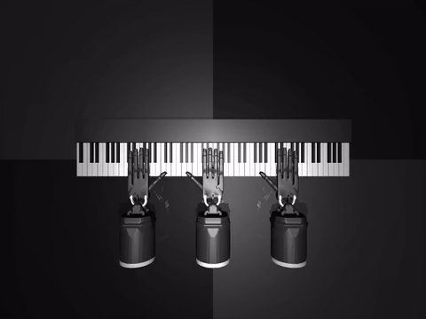
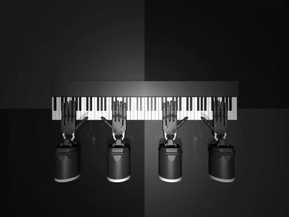
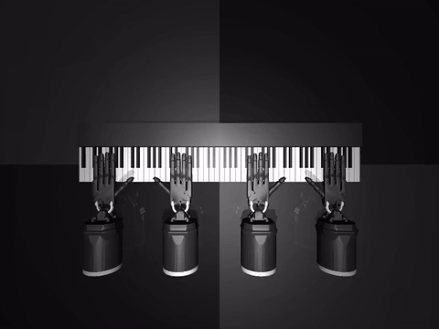
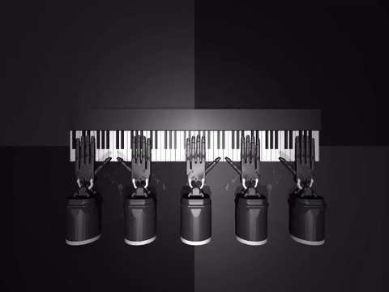
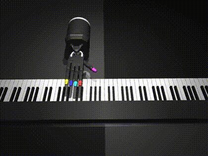
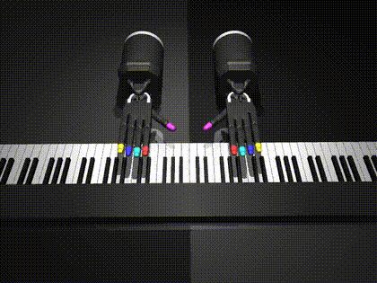

# OmniPiano Framework Architecture Guide

`OmniPiano` is a **general RL benchmark** built on top of DeepMind's
`robopianist`. The current task suites cover:

* **Morphology** — N-hand piano control (2 / 3 / 4 / 5 hands), with both
  unconstrained (Level-3) prototypes and Level-1 `StaticPartition`
  variants that hard-clamp each hand to a non-overlapping key range.
* **Safety** — joint magnitude limits, hand-hand collisions (binary +
  continuous force), dense actuator power cost, joint-injury budgets,
  shared per-joint ceilings, and summed-chain budgets.
* **Robustness** — Gaussian action noise and per-key observation noise
  with magnitude reporting.
* **Task variants** — left/right-hand-immobile, alternative fingering
  rewards (annotation vs OT), repertoire ablations.

The benchmark is **algorithm-agnostic** and **framework-agnostic** — any
trainer that consumes the standard Gymnasium API (`reset` / `step`,
`info["episode_task/*"]`, `info["step_safety/*"]`) can use OmniPiano.
The public release deliberately does NOT ship trainer templates: users
write a thin trainer in their framework of choice (Stable Baselines 3,
sb3-contrib, OmniSafe, RLlib, CleanRL, Mava, MARLlib, ...) that calls
`OmniPiano.make(env_id)` — see the "Training + evaluation" section
below for the minimal boilerplate and the metrics surface.

The framework employs a "sandwich" architecture design:
1. **Top Layer (Registry & Examples)**: Provides a unified, extremely simple interface for users to instantiate pre-defined benchmark tasks via a Task Registry.
2. **Middle Layer (Gymnasium Wrappers)**: Handles signal-level noise injection, safety cost calculation, and metric extraction through decoupled wrappers.
3. **Bottom Layer (Task & mjcf)**: Intercepts the underlying physics compilation process to enable dynamic modification of the MuJoCo XML tree.

## Selected Demos

### Morphology Ladder — N-hand piano control

The morphology ladder demonstrates how N-hand control scales across pieces and
partition levels. Each clip below is a deterministic rollout of the best
checkpoint of its respective trained policy, rendered with the `piano/topdown`
camera so the full 88-key keyboard and every hand are visible at once.

<p align="center">
  <strong><code>OmniPiano-ForElise-ThreeHandPrototype-v0</code></strong><br/>
  <sub>3 hands, no partition · SAC 5M · F1 = 0.52</sub><br/>
  <sub>⚠ <em>Demo GIF rendered under the pre-2026-05 round-number 3-hand positions (±0.30 / 0.0). The current registered env uses bucket-center positions (±0.4051 / 0.0) per the N-hand morphology axiom; a fresh demo will be rendered once the policy is retrained on the new geometry.</em></sub>
</p>
<p align="center">
  
</p>

<p align="center">
  <strong><code>OmniPiano-WinterWind-FourHandPrototype-v0</code></strong><br/>
  <sub>4 hands, no partition · TQC 10M · F1 = 0.42</sub>
</p>
<p align="center">
  
</p>

<p align="center">
  <strong><code>OmniPiano-WinterWind-FourHand-StaticPartition-v0</code></strong><br/>
  <sub>4 hands, Level-1 static partition · TQC 5M · F1 = 0.39</sub>
</p>
<p align="center">
  
</p>

<p align="center">
  <strong><code>OmniPiano-WinterWind-FiveHand-StaticPartition-v0</code></strong><br/>
  <sub>5 hands, Level-1 static partition · TQC 8M · F1 = <strong>0.46</strong></sub>
</p>
<p align="center">
  
</p>

**What to look for:**

- **3-hand / 4-hand without partition** — outer hands often park near the keyboard
  edges and stay idle. This is the OT-induced "winner-takes-all" pathology
  diagnosed in the multi-hand reward design (see `static_partition_design.md`).
- **4-hand / 5-hand with Level-1 static partition** — every hand is hard-clamped
  by MuJoCo to its assigned register slice via `forearm_tx` joint range, so all
  hands actively engage with their region. Per-hand `key_range` is converted to
  arena Y bounds via `OmniPiano/tasks/hand_spec.key_range_to_y_range`, with
  fingertip overshoot of ~7 keys at boundaries giving emergent "hard-core /
  soft-boundary" cooperation.

The 5-hand Level-1 result (F1 = 0.46) is the highest score in the ladder despite
having the highest action dimension (111) and the fewest training steps relative
to action complexity — evidence that physical partition more than compensates for
the increased control burden.

### Single-piece structural-conflict demos

GIFs below illustrate the task TYPE on TwinkleTwinkleLittleStar (an
unregistered debug piece used for smoke-tests only). The registered
benchmark envs of the same task type — listed below each GIF — run on
PIG-150 pieces with substantially harder reward landscapes.

<p align="center">
  <strong>Right-Hand-Only task</strong><br/>
  <sub>illustration on TwinkleTwinkleLittleStar debug piece<br/>
  Registered env: <code>OmniPiano-NocturneOp9No2-RightHandOnly-v0</code></sub>
</p>
<p align="center">
  
</p>
<p align="center">
  <strong>Collision-Safe task</strong><br/>
  <sub>illustration on TwinkleTwinkleLittleStar debug piece<br/>
  Registered envs: <code>OmniPiano-ClairDeLune-CollisionSafe-v0</code>,
  <code>OmniPiano-MapleLeafRag-CollisionSafe-v0</code></sub>
</p>
<p align="center">
  
</p>
<p align="center">
  Animated previews are loaded from the repository <code>demos/</code> folder.
</p>

## Quick Start

### Installation

OmniPiano is supported on Linux and can be installed with Python >= 3.10.
We recommend using [Miniconda](https://docs.conda.io/en/latest/miniconda.html) or
[Miniforge](https://github.com/conda-forge/miniforge) to manage your Python
environment.

> **Note**: Unlike the original RoboPianist, OmniPiano bundles the Shadow Hand
> model files and the default soundfont (`TimGM6mb.sf2`) directly in the
> repository. You do **not** need to run `git submodule` or `install_deps.sh`.

**Step 1 — Install system dependencies**

```bash
sudo apt-get update
sudo apt-get install -y build-essential fluidsynth libfluidsynth-dev portaudio19-dev ffmpeg
```

**Step 2 — Create a conda environment**

```bash
conda create -n pianist python=3.10 -y
conda activate pianist
```

**Step 3 — Clone and install**

```bash
git clone https://github.com/SafeRL-Lab/omnipiano.git
cd omnipiano
pip install -e .
```

**Step 4 — Preprocess the PIG dataset (required)**

All benchmark tasks use pieces from the
[PIG dataset](https://beam.kisarazu.ac.jp/~saito/research/PianoFingeringDataset/).
Download `PianoFingeringDataset_v1.2.zip` from the PIG website (free registration
required), extract it, then run:

```bash
robopianist preprocess --dataset-dir /PATH/TO/PianoFingeringDataset_v1.2
robopianist --check-pig-exists   # should print "PIG dataset is ready to use!"
```

**Step 5 — Verify installation**

```bash
# Quick sanity check using a built-in debug piece (no PIG needed)
python -c "from OmniPiano.envs.robopianist import suite; env = suite.load('RoboPianist-debug-TwinkleTwinkleLittleStar-v0'); print('OK')"

# Verify a benchmark task (requires PIG)
python -c "from OmniPiano import make; env = make('OmniPiano-ClairDeLune-CollisionSafe-v0'); print('OK')"
```

**Step 6 (Optional) — Download a higher-quality soundfont**

The default soundfont (`TimGM6mb.sf2`) is bundled for basic audio synthesis.
For higher-quality piano sound in recorded videos:

```bash
robopianist soundfont --download
```

### Available Tasks

| Task ID | Category | Piece | Description |
|---------|----------|-------|-------------|
| `OmniPiano-ForElise-WristLimit-v0` | Safety | Für Elise | Right wrist pitch magnitude limit |
| `OmniPiano-NocturneOp9No2-RightHandOnly-v0` | Variant | Nocturne Op.9 No.2 | Left hand frozen, right hand solo |
| `OmniPiano-ClairDeLune-CollisionSafe-v0` | Safety | Clair de Lune | Binary hand-hand collision cost |
| `OmniPiano-MapleLeafRag-CollisionSafe-v0` | Safety | Maple Leaf Rag | Binary collision, high overlap |
| `OmniPiano-PolonaiseOp53-PowerConstrained-v0` | Safety | Polonaise Op.53 | Dense actuator power cost |
| `OmniPiano-FantaisieImpromptu-PowerConstrained-v0` | Safety | Fantaisie-Impromptu | Dense power, fast tempo |
| `OmniPiano-FantaisieImpromptu-ActionRobust-v0` | Robustness | Fantaisie-Impromptu | Gaussian noise on actions |
| `OmniPiano-MapleLeafRag-CollisionForce-v0` | Safety | Maple Leaf Rag | Continuous contact force cost |
| `OmniPiano-EtudeOp10No12-CollisionForce-v0` | Safety | Revolutionary Etude | Continuous force, max overlap |
| `OmniPiano-ClairDeLune-ObservationRobust-v0` | Robustness | Clair de Lune | Gaussian noise on observations |
| `OmniPiano-ForElise-WristInjury-v0` | Safety | Für Elise | Right wrist power cost with OT fingering |
| `OmniPiano-NocturneOp9No2-ThumbInjury-v0` | Safety | Nocturne Op.9 No.2 | Right thumb power cost with OT fingering |
| `OmniPiano-FantaisieImpromptu-ForearmInjury-v0` | Safety | Fantaisie-Impromptu | Right forearm power cost with OT fingering |
| `OmniPiano-ClairDeLune-BimanualMiddleFingerLimitOT-v0` | Safety | Clair de Lune | OT fingering with shared per-joint ceiling on both middle fingers |
| `OmniPiano-MapleLeafRag-BimanualWristMiddleLimitOT-v0` | Safety | Maple Leaf Rag | OT fingering with shared per-joint ceiling on wrists + middle fingers |
| `OmniPiano-NocturneOp9No2-LeftWristMiddleLimitOT-v0` | Safety | Nocturne Op.9 No.2 | OT fingering with left-hand asymmetric shared ceiling |
| `OmniPiano-NocturneOp9No2-BimanualThumbBudgetOT-v0` | Safety | Nocturne Op.9 No.2 | OT fingering with summed thumb-chain budget |
| `OmniPiano-FantaisieImpromptu-BimanualWristThumbBudgetOT-v0` | Safety | Fantaisie-Impromptu | OT fingering with summed wrist+thumb budget |
| `OmniPiano-PolonaiseOp53-BimanualThumbLittleBudgetOT-v0` | Safety | Polonaise Op.53 | OT fingering with summed thumb+little-finger budget |

#### Morphology-Ladder Tasks (N-hand piano control)

These tasks share the same MIDI repertoire but vary in number of hands and
in whether each hand's `forearm_tx` slider is hard-clamped to a register
slice (Level-1 static partition). All Level-1 tasks consume `key_range` on
their `HandSpec`s and resolve it to MuJoCo joint ranges via
`key_index_to_y` / `key_range_to_y_range`. See `static_partition_design.md`
for the design rationale and empirical results.

All N-hand attach positions follow the **N-hand morphology axiom**: each
hand's wrist sits at the geometric center of its canonical key-range
bucket. Prototype (L-3) and StaticPartition (L-1) variants of the same
N-hand morphology share identical attach geometry — they differ only in
whether the `forearm_tx` slider is hard-clamped to its bucket. See
`static_partition_design.md` § 4.5 for the rule and bucket schemes.

| Task ID | N-hands | Partition | Piece (steps · min_bkt · eqN) |
|---------|---------|-----------|-------|
| `OmniPiano-WinterWind-ThreeHandPrototype-v0` | 3 | none (L-3) | Étude Op.25 No.11 (314 · 17% · 0%) |
| `OmniPiano-ForElise-ThreeHandPrototype-v0` | 3 | none (L-3) | Für Elise (399 · 10% · 0%) — pedagogical "vestigial 3rd hand" |
| `OmniPiano-PicturesGreatKiev-ThreeHandPrototype-v0` | 3 | none (L-3) | Pictures: Great Gate of Kiev (720 · 14% · **35%** ⭐) |
| `OmniPiano-PolonaiseOp40No1-ThreeHandPrototype-v0` | 3 | none (L-3) | Chopin "Military" Polonaise (563 · 12% · 27%) |
| `OmniPiano-PianoSonataNo281StMov-ThreeHandPrototype-v0` | 3 | none (L-3) | Mozart K.545 "Facile" 1st mvt (301 · 7% · 23%) — shortest |
| `OmniPiano-WinterWind-ThreeHand-StaticPartition-v0` | 3 | Level-1 (3 buckets, 29/30/29 keys) | Étude Op.25 No.11 |
| `OmniPiano-PicturesGreatKiev-ThreeHand-StaticPartition-v0` | 3 | Level-1 (3 buckets, 29/30/29 keys) | Pictures: Great Gate of Kiev |
| `OmniPiano-PolonaiseOp40No1-ThreeHand-StaticPartition-v0` | 3 | Level-1 (3 buckets, 29/30/29 keys) | Chopin "Military" Polonaise |
| `OmniPiano-PianoSonataNo281StMov-ThreeHand-StaticPartition-v0` | 3 | Level-1 (3 buckets, 29/30/29 keys) | Mozart K.545 "Facile" 1st mvt |
| `OmniPiano-WinterWind-FourHandPrototype-v0` | 4 (L-R-L-R) | none (L-3) | Étude Op.25 No.11 (314 · 9% · 0%) |
| `OmniPiano-PianoSonataNo301StMov-FourHandPrototype-v0` | 4 (L-R-L-R) | none (L-3) | Mozart K.330 1st mvt (571 · 4% · 2%) |
| `OmniPiano-PicturesGreatKiev-FourHandPrototype-v0` | 4 (L-R-L-R) | none (L-3) | Pictures: Great Gate of Kiev (720 · 12% · **10%** ⭐) |
| `OmniPiano-WinterWind-FourHand-StaticPartition-v0` | 4 (L-R-L-R) | Level-1 (4 buckets × 22 keys) | Étude Op.25 No.11 |
| `OmniPiano-PianoSonataNo301StMov-FourHand-StaticPartition-v0` | 4 (L-R-L-R) | Level-1 (4 buckets × 22 keys) | Mozart K.330 1st mvt |
| `OmniPiano-PicturesGreatKiev-FourHand-StaticPartition-v0` | 4 (L-R-L-R) | Level-1 (4 buckets × 22 keys) | Pictures: Great Gate of Kiev |
| `OmniPiano-WinterWind-FiveHandPrototype-v0` | 5 (L-R-L-R-R) | none (L-3) | Étude Op.25 No.11 (314 · 5% · 0%) |
| `OmniPiano-PicturesGreatKiev-FiveHandPrototype-v0` | 5 (L-R-L-R-R) | none (L-3) | Pictures: Great Gate of Kiev (720 · 7% · 1%) — only PIG-150 piece passing 5-hand filter |
| `OmniPiano-WinterWind-FiveHand-StaticPartition-v0` | 5 (L-R-L-R-R) | Level-1 (5 buckets, 18/18/17/18/17 keys) | Étude Op.25 No.11 |

> **Notation**: `steps · min_bkt · eqN` = episode length · minimum bucket
> occupancy · % of steps with ALL N buckets simultaneously active. Higher
> `eqN` = more genuine N-hand coordination needed. Filter-passing pieces
> (per `examples/repertoire/analyze_{N}hand.py`): 39 / 2 / 1 for 3/4/5-hand
> respectively. `PicturesGreatKiev` is the only piece passing all three
> filters and serves as the cross-ladder stress-test anchor.

> **Repertoire selection note**: LaCampanella was previously registered for
> 4-hand and 5-hand variants but DROPPED across the entire morphology ladder —
> its lowest pitch is key 30 (D2#), leaving the bass bucket of every partition
> scheme (5-bucket B0 / 4-bucket B0) at 0% activity, which would idle the
> bass-most hand.
>
> The 3-hand suite uses **WinterWind** (anchor, eq3=0%, 314 steps), **ForElise**
> (pedagogical negative example, Prototype only — eq3=0%, 79% middle bucket),
> **PicturesGreatKiev** (cross-ladder stress, eq3=35%, 720 steps),
> **PolonaiseOp40No1** (high-eq3 medium-length, eq3=27%, 563 steps), and
> **PianoSonataNo281StMov** (shortest top-tier, eq3=23%, 301 steps).
>
> The 4-hand suite uses **WinterWind** (anchor), **PicturesGreatKiev**
> (the only PIG-150 piece with eq4 > 10%), and **PianoSonataNo301StMov**
> (Mozart K.330; included as a bucket-imbalanced control — min_bkt=4.2%
> just under the 5% guideline). PianoSonataNo301StMov is **4-hand only**;
> dropped from 3-hand after a 2026-05 PIG-150 rerun showed
> PolonaiseOp40No1 dominates it on every 3-hand metric at similar length.
>
> Empirical numbers (per-bucket distribution, polyphony, length) are
> documented inline in `OmniPiano/envs/__init__.py` for traceable future
> repertoire replacement.

### Minimal Example

```python
from OmniPiano import make

env = make("OmniPiano-ClairDeLune-CollisionSafe-v0")
obs, info = env.reset(seed=42)

for _ in range(100):
    action = env.action_space.sample()
    obs, reward, terminated, truncated, info = env.step(action)

    cost = info["step_safety/cost_total"]              # per-step safety cost

    if terminated or truncated:
        obs, info = env.reset()

env.close()
```

### Registry-first contract

`make(env_name, log_dir=None, log_split="train", **kwargs)` enforces a
**strict registry-only contract**:

* `env_name` MUST be a registered task id (see `OmniPiano/envs/__init__.py`
  for the full list). Unknown ids raise `ValueError` listing every valid
  id — typo-resistant.
* All experiment-defining configs (`safety`, `robust`, `task_variant`,
  `env_config`, `hand_specs`) come from the registered `TaskSpec` only.
  To vary any of them, **register a new task id** rather than overriding
  at make() time. This keeps every experiment configuration tied to a
  canonical, traceable id — `eval_summary.json` records `env_name` and
  algorithm hparams; together they fully describe the run.
* `**kwargs` is whitelisted to **runtime-bypass** fields that don't
  affect the policy's training trajectory:
  `seed`, `record_dir`, `record_every`, `record_resolution`,
  `camera_id`. Anything else (`n_steps_lookahead`, `frame_stack`,
  `disable_fingering_reward`, `hand_specs`, ...) raises `ValueError`.

### Training + evaluation

OmniPiano ships **only environments, wrappers, and protocol defaults** —
it does not own a rollout loop. Training and evaluation are the
framework's responsibility, and OmniPiano is intentionally
framework-agnostic: any RL stack (Stable Baselines 3, sb3-contrib,
RLlib, CleanRL, Mava, MARLlib, OmniSafe, JAX-based libraries, ...) can
consume an OmniPiano env through the standard Gymnasium API.

The minimum a trainer needs:

```python
from OmniPiano import make

env = make("OmniPiano-WinterWind-FourHand-StaticPartition-v0", seed=42)
obs, info = env.reset()
# ... your trainer's vec-env / rollout / eval loop here ...
```

OmniPiano exposes:

* **Reward** — standard gymnasium `step()` return; the per-step task
  reward composed from key_press / sustain / fingering (OT or
  annotation) / forearm / energy terms.
* **Per-step safety cost** — `info["step_safety/cost_total"]` for
  CMDP-style algorithms (PPOLag, CPO, SafeAC, ...).
* **Episode-level metrics** — `info["episode_task/f1"]`,
  `info["episode_task/key_precision"]`, `info["episode_task/sustain_f1"]`,
  etc., emitted at episode termination for offline aggregation.

The protocol-level constants intended to be **shared across frameworks**
for fair comparison are in `BenchmarkProtocolConfig`
(`OmniPiano/configs/__init__.py`):
total env-step budget, evaluation seed, and final-eval episode count.
Algorithm-specific hyperparameters (`gamma`, `batch_size`, network
architecture, etc.) belong in each trainer's own configuration —
OmniPiano deliberately takes no opinion there.

Paper-style N-seed replication: run your trainer N times with distinct
seeds and aggregate the per-run `eval_summary.json` files offline.

## Current Package Layout

The previous README described an older structure (`configs.py`,
`safe_piano_env.py`, `tasks/registry.py`, `safe_piano_task.py`, etc.). The
current codebase is organized as follows:

```text
OmniPiano/
├── __init__.py
├── configs/
│   └── __init__.py             # All config dataclasses
├── envs/
│   ├── __init__.py             # Task registrations (register(...) calls)
│   ├── registration.py         # make() factory + TaskSpec + registry
│   ├── dm_env_adapter.py       # Custom dm_env -> gymnasium adapter (no shimmy)
│   ├── dm_env_obs_noise.py     # Per-key observation noise wrapper (dm_env layer)
│   └── robopianist/            # Vendored upstream robopianist (READ-ONLY)
├── tasks/
│   ├── __init__.py
│   ├── omni_piano_task.py      # OmniPianoTask: MJCF-level task variants
│   └── hand_spec.py            # HandSpec: N-hand morphology declarations +
│                               # Level-1 partition (key_range / y_range) +
│                               # default_{three,four,five}_hand_specs() +
│                               # key_index_to_y / key_range_to_y_range
├── safety/
│   └── constraints.py          # BaseConstraint + concrete safety rules
├── wrappers/
│   ├── __init__.py
│   ├── metrics_wrapper.py      # task reward terms + episode metrics -> info
│   ├── safety_wrapper.py       # safety constraint cost -> info
│   └── robust_wrapper.py       # action noise + obs noise reporting
├── utils/
│   ├── env_unwrap.py           # gym/dm_env unwrap helpers
│   ├── info_keys.py            # canonical info-dict key constants
│   └── logger_wrapper.py       # eval-time episode CSV logger
└── integrations/
    └── sb3/
        ├── __init__.py
        └── iteration_summary_callback.py   # SB3-specific train logger
```

The `examples/` directory of this repository is **deliberately empty in
the public release** — it is reserved for project-internal experiment
configurations, paper-writing analysis tools, and rendering helpers
that are tied to specific RL frameworks (SB3 / sb3-contrib / OmniSafe).
Including those would push every adopter toward our particular
training stack, contradicting OmniPiano's framework-agnostic design.

For training and evaluation, write a thin trainer in your own
framework that calls `OmniPiano.make(env_id)`. See "Training +
evaluation" above for the minimal boilerplate and the metrics surface.

## High-Level Execution Flow

The end-to-end environment construction pipeline (paper-chain layout —
mirrors `robopianist-rl/train.py:get_env()` at the dm_env layer):

1. `import OmniPiano`
   `OmniPiano/__init__.py` exposes `make` and `register`, and imports
   `OmniPiano.envs` for registration side effects.
2. Registered tasks are declared in `OmniPiano/envs/__init__.py`
   Each task is added with `register(id=..., base_env_name=..., ...)`.
3. `OmniPiano.envs.registration.make(env_name, **kwargs)` resolves configs
   `env_name` MUST be a registered id (unknown names raise `ValueError`).
   All four configs (`safety`, `robust`, `task_variant`, `env`) and
   `hand_specs` come from the registered `TaskSpec`. Caller `**kwargs`
   are strictly whitelisted to runtime-bypass fields (`seed`,
   `record_dir`, `record_every`, `record_resolution`, `camera_id`);
   anything else raises `ValueError`. To vary an experiment-defining
   parameter, register a new task id.
4. `suite.load_with_task(..., task_cls=OmniPianoTask, stretch=, shift=, ...)`
   builds the base task with the vendored `robopianist` task class.
5. dm_env-level wrappers are applied in this order:
   `EpisodeStatisticsWrapper` -> `[PianoSoundVideoWrapper if record_dir]`
   -> `MidiEvaluationWrapper` -> `[DmEnvObsNoiseWrapper if obs_noise_std>0]`
   -> `[ObservationActionRewardWrapper if action_reward_observation]`
   -> `ConcatObservationWrapper` (Dict -> flat ndarray)
   -> `[FrameStackingWrapper if frame_stack>1]`
   -> `CanonicalSpecWrapper(clip=...)` -> `SinglePrecisionWrapper`.
6. The dm_env is converted to Gymnasium via the custom
   `OmniPiano.envs.dm_env_adapter.DmEnvToGymnasium` adapter (no shimmy,
   no monkey-patching). The adapter's `reset(seed=X)` rebuilds the
   chain on demand to honor gymnasium's reseed contract — required
   because `dm_control.composer_utils.Environment` fixes its
   `random_state` at construction time.
7. Gym-level wrappers are applied in a fixed order:
   `MetricsWrapper` -> `SafetyWrapper` -> `RobustWrapper`.
8. Eval-only episode CSV logging is added when `log_split == "eval"`:
   `SafeRecordEpisodeStatistics` writes eval episode metrics to CSV.

## Module Responsibilities

### 1. Package Entry Point
* **`OmniPiano/__init__.py`**
  * **Role**: The public package entry point.
  * **Responsibilities**: Ensures the vendored `robopianist` under `OmniPiano/envs/` is found first on `sys.path`, re-exports `make` and `register`, and triggers task registration through the import of `OmniPiano.envs`.

### 2. Core Configuration & Registry
* **`OmniPiano/configs/__init__.py`**
  * **Role**: Defines the benchmark configuration dataclasses.
  * **Content**:
    1. `SafetyConfig`: list of instantiated safety constraints.
    2. `RobustConfig`: perturbation parameters (`action_noise_std`, `obs_noise_std`).
    3. `TaskVariantConfig`: **OmniPiano-only** XML/MJCF-level task variants applied inside `OmniPianoTask._apply_task_variants` (`left_hand_immobile`, `right_hand_immobile`). Paper-comparable env parameters (e.g., `disable_fingering_reward`) live in `BenchmarkEnvConfig`, not here.
    4. `LoggingConfig`: shared logging configuration (log directory, split).
    5. `BenchmarkProtocolConfig`: **algorithm-agnostic** shared protocol (total env-step budget, scalar seed, `num_eval_eps`, `protocol_version`). The single source of truth for cross-framework comparability. Algorithm hyperparameters (`batch_size`, `discount`, `replay_capacity`, `warmstart_steps`, etc.) deliberately live in each trainer's argparse defaults and are dumped to `eval_summary.json["hparams"]`.
    6. `BenchmarkEnvConfig`: shared task-environment defaults — listed in the **same order as `robopianist-rl/train.py:Args`** (21 fields including `n_steps_lookahead`, `trim_silence`, `gravity_compensation`, `disable_fingering_reward`, `frame_stack`, `clip`, `action_reward_observation`, recording knobs, etc.), with each field annotated `=` (paper-same) / `≠ run.sh adopts` / `≠ OmniPiano-fixed`. This is the audit point for paper-vs-OmniPiano env diff.
* **`OmniPiano/envs/__init__.py`**
  * **Role**: The official repository of benchmark task declarations.
  * **Content**: Registers all benchmark tasks through `register(...)`. Each task maps a human-readable benchmark ID to its `TaskSpec`, which bundles the base environment name plus the default safety, robustness, and task-variant configurations. Current tasks span: (a) safety/robustness — wrist-limit, right-hand-only, binary collision, continuous collision force, dense power cost, action/observation robustness, injury-style power constraints, OT fingering with shared per-joint ceilings, and OT fingering with summed chain budgets; (b) **morphology ladder** — N-hand variants (3 / 4 / 5 hands) with both Level-3 prototypes (no partition; full keyboard reach) and Level-1 `*-StaticPartition-v0` variants that hard-clamp each hand's `forearm_tx` slider to a non-overlapping key range, breaking the OT-induced "winner-takes-all" idle-hand pathology.

### 3. Environment Assembly Factory (`envs/`)
* **`OmniPiano/envs/registration.py`**
  * **Role**: The entry point factory for environment creation.
  * **Responsibilities**:
    1. Implements the `register()` + `make()` pattern.
    2. Enforces a strict registry-only contract: unknown `env_name` raises `ValueError`. All experiment-defining configs (`safety`, `robust`, `task_variant`, `env`, `hand_specs`) are sourced exclusively from the `TaskSpec` — to vary any of them, register a new task id rather than overriding at make() time.
    3. Validates caller `**kwargs` against a runtime-bypass whitelist (`seed`, `record_dir`, `record_every`, `record_resolution`, `camera_id`); any other key raises `ValueError`.
    4. Calls `suite.load_with_task(..., task_cls=OmniPianoTask, ...)` to instantiate `OmniPianoTask` on top of the vendored RoboPianist task, with `stretch` / `shift` from the resolved `BenchmarkEnvConfig`.
    5. Builds the dm_env wrapper chain (paper-chain layout): `EpisodeStatistics` -> optional `PianoSoundVideo` -> `MidiEvaluation` -> optional `DmEnvObsNoise` -> optional `ObservationActionReward` -> `ConcatObservation` -> optional `FrameStacking` -> `CanonicalSpec(clip=...)` -> `SinglePrecision`.
    6. Converts dm_env -> Gymnasium via the custom `DmEnvToGymnasium` adapter (no shimmy).
    7. Applies the gym-level wrapper stack: `MetricsWrapper` -> `SafetyWrapper` -> `RobustWrapper`.
    8. Optionally adds eval-time CSV episode logging when `log_split == "eval"`.
* **`OmniPiano/envs/dm_env_adapter.py`**
  * **Role**: Custom `dm_env -> gymnasium.Env` adapter (replaces shimmy).
  * **Responsibilities**: Wraps a dm_env builder closure, exposes the gymnasium API (`reset` / `step` / `action_space` / `observation_space`), and honors `reset(seed=X)` by rebuilding the dm_env chain on demand — because `dm_control.composer_utils.Environment` fixes its `random_state` at construction time and exposes no setter. Required for any framework that respects gym's reseed contract (SB3 `make_vec_env`, OmniSafe vec envs, gymnasium's `AsyncVectorEnv`, etc.).
* **`OmniPiano/envs/dm_env_obs_noise.py`**
  * **Role**: Per-key observation noise injection at the dm_env layer (before `ConcatObservationWrapper`).
  * **Responsibilities**: Applied conditionally when `RobustConfig.obs_noise_std > 0`. Operates on the dm_env Dict observation so it can pick noise targets by key name (skipping categorical / counter keys like `goal`); writes its last-step L2 noise magnitude as a side channel that `RobustWrapper` reads at the gym layer for logging.

### 4. Low-Level Physics Interceptor (`tasks/`)
* **`OmniPiano/tasks/omni_piano_task.py`**
  * **Role**: The low-level task customization layer that reaches into the MuJoCo/MJCF build process.
  * **Responsibilities**: Subclasses `robopianist.suite.tasks.piano_with_shadow_hands.PianoWithShadowHands`, intercepts task construction after the default MJCF tree is built, and applies structural task variants such as freezing one hand by clamping joint ranges, clamping actuator control ranges, and relocating the frozen hand away from the piano. This is the correct layer for physical task modifications because it changes the underlying MJCF/composer task itself rather than only post-processing observations or actions.

### 5. Safety Constraint Definitions (`safety/`)
* **`OmniPiano/safety/constraints.py`**
  * **Role**: The mathematical logic library defining what is "unsafe".
  * **Responsibilities**: Defines the modular safety constraint interface (`BaseConstraint`) and concrete implementations such as joint magnitude limits, hand collision cost, and total actuator power cost. Each constraint computes its per-step cost independently from reward, writes its own metric key into `info`, and can be extended without modifying the core environment factory or wrapper pipeline.

### 6. Modular Wrappers (`wrappers/`)
These wrappers follow the standard Gymnasium API and handle the data flow between the agent and the underlying physics environment.

* **`OmniPiano/wrappers/metrics_wrapper.py`**
  * **Role**: Responsible for extracting task-side metrics.
  * **Responsibilities**: Reads raw reward terms from the underlying composer task, reads musical metrics from `MidiEvaluationWrapper`, standardizes exported keys through `OmniPiano/utils/info_keys.py`, and aggregates episode-level task metrics. This wrapper is applied to all tasks to keep benchmark logging consistent across safety-only, robustness-only, and mixed tasks.
* **`OmniPiano/wrappers/safety_wrapper.py`**
  * **Role**: Responsible for executing safety constraints and exposing costs.
  * **Responsibilities**: Iterates through all configured safety constraints, aggregates per-step and per-episode safety cost, writes safety signals into `info`, and intentionally does **not** modify the environment reward. This preserves the benchmark principle that reward-cost trade-offs should be handled by the RL algorithm rather than hard-coded inside the environment.
* **`OmniPiano/wrappers/robust_wrapper.py`**
  * **Role**: Responsible for the action-noise side of signal-level robustness perturbation and for aggregating perturbation magnitudes at the gym layer.
  * **Responsibilities**: Injects action noise before forwarding actions to the wrapped environment, reads the per-step observation-noise L2 magnitude exported by the dm_env-layer `DmEnvObsNoiseWrapper` (where the actual observation-noise injection happens — see `dm_env_obs_noise.py` below), and writes both action- and observation-noise magnitudes to `info` for analysis. Splitting observation-noise injection into the dm_env layer (`DmEnvObsNoiseWrapper`) keeps per-key noise targets — e.g., skipping categorical / counter observables like `goal` — operating on the raw observation Dict before `ConcatObservationWrapper` flattens it. This keeps robustness perturbations decoupled from both the base task definition and the safety-cost computation logic.

### 7. Metrics & Logging Utilities (`utils/`)
* **`OmniPiano/utils/info_keys.py`**
  * **Role**: The unified data dictionary for the framework.
  * **Responsibilities**: Defines the canonical step-level and episode-level `info` keys used across wrappers, callbacks, and loggers. This avoids hard-coded string duplication and keeps metric naming consistent across training, evaluation, CSV export, and future algorithm integrations.
* **`OmniPiano/utils/env_unwrap.py`**
  * **Role**: The shared unwrapping utility layer.
  * **Responsibilities**: Centralizes wrapper-unwrapping logic so benchmark wrappers can safely recover the underlying dm_env/composer environment from a Gymnasium wrapper stack. This makes the metrics and safety code less fragile when the wrapper chain changes.
* **`OmniPiano/utils/logger_wrapper.py`**
  * **Role**: The evaluation-phase episode logger.
  * **Responsibilities**: Records episode metrics to CSV without coupling logging to a specific RL algorithm. This is mainly used for evaluation-time episode logging.

### 8. Framework Integrations (`integrations/`)
Framework-specific glue code is isolated under `integrations/<framework>/`
so the OmniPiano core (`envs/`, `wrappers/`, `configs/`, `tasks/`,
`safety/`, `utils/`) stays framework-agnostic. Only files under
`integrations/<framework>/` may depend on a specific RL framework's
internals.

* **`OmniPiano/integrations/sb3/iteration_summary_callback.py`**
  * **Role**: The training-phase iteration logger used by the SB3 templates.
  * **Responsibilities**: Aggregates completed training episodes per iteration and writes `train_iteration_summary.csv`. SB3-specific (consumes `BaseCallback`); analogous OmniSafe / other-framework loggers, if needed, would live under their own `integrations/<framework>/` subpackage.

## Example Entry Points

The public release of OmniPiano intentionally **does not ship trainer
or rendering examples**. The benchmark surface is `OmniPiano.make()`
plus the registered env ids; how to wire that into a particular RL
framework is left to the adopter's choice (see "Training + evaluation"
above for the minimal call pattern).

For framework-specific reference implementations (SB3 PPO/SAC, TQC via
sb3-contrib, OmniSafe PPOLag scaffolds, MP4 rendering of saved
checkpoints, repertoire-analysis CSV tools, ...) we maintain a
project-internal collection under `examples/` that is **not part of the
public repository**. These are tools the OmniPiano team uses for paper
experiments and demos; they hard-code algorithm choices and
hyperparameters that should not propagate to users of the benchmark.

## Design Documents

In-depth architecture and rationale for the larger features live in
companion design docs at the repository root:

* **`three_hand_design.md`** — Phase-1 N-hand refactor: how the
  `HandSpec` dataclass + N-hand `PianoTask` generalize the original
  hardcoded 2-hand pair, what changed in `base.py`, and the regression
  guards.
* **`static_partition_design.md`** — Level-1 static partition: hard
  joint-level partition vs soft fingertip overshoot (~7-key boundary
  cooperation), L-R-L-R 4-hand and L-R-L-R-R 5-hand layouts, position-
  to-bucket-center alignment math, repertoire selection from full
  PIG-150 scan, and paper-writing claims with empirical numbers.

These are dev-facing references for code review and paper writing —
they are not user manuals. End-user usage patterns live in this README
and in module docstrings (e.g., `OmniPiano/envs/__init__.py` for
registered task IDs, `OmniPiano/wrappers/*.py` for wrapper semantics).
The local `examples/` directory contains framework-specific reference
implementations (SB3 / sb3-contrib / OmniSafe trainers, MP4 rendering,
repertoire analysis CSV tools) but is **gitignored / not part of the
public release** — see the `examples/` note in "Repository Layout" above
for the framework-agnostic rationale.

## Notes on Installation

`setup.py` only defines the Python package and Python dependencies. It does not
create a conda environment.

For a fresh machine, installation should be thought of as three layers:

1. system dependencies such as `fluidsynth`, `portaudio`, and `ffmpeg`,
2. a Python environment such as a conda env,
3. `pip install -e .` to install `OmniPiano`.

If you want, this README can be extended further with a concrete installation
section once the repository-level environment/bootstrap files are finalized.